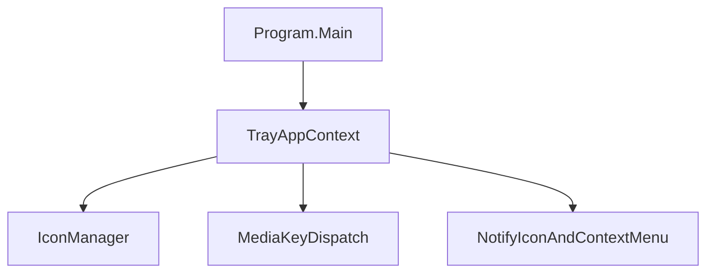

# TaskbarMediaControls-plus Development Guide

This guide is for contributors and AI agents working on `TaskbarMediaControls-plus`.
It focuses on three outcomes:

- Runnable on this device (or any Windows dev machine with .NET 8 SDK installed)
- Developable by AI using consistent prompts and validation steps
- Testable with both automated checks and a manual behavior checklist

## 1) Environment and Prerequisites

### Required

- Windows 10/11 (project targets `net8.0-windows`)
- .NET 8 SDK

### Optional but recommended

- Visual Studio 2022 (Desktop development with .NET workload)
- VS Code + C# Dev Kit
- Inno Setup (only needed for installer builds via `setup.iss`)

### Verify your environment

From repository root:

```powershell
dotnet --version
```

If you see `No .NET SDKs were found`, install .NET 8 SDK:

- https://aka.ms/dotnet/download

## 2) Run and Debug Locally (Runnable)

Project root: `D:/_installed/VScode repos/_Extra_Work/TaskbarMediaControls`

### CLI workflow

```powershell
dotnet restore "./TaskbarMediaControls.sln"
dotnet build "./TaskbarMediaControls.sln"
dotnet run --project "./TaskbarMediaControls.csproj"
```

### Visual Studio workflow

1. Open `TaskbarMediaControls.sln`
2. Set configuration to `Debug` and platform to `Any CPU` (or default)
3. Press `F5`

### What should happen

- App starts as a tray app with three icons:
  - Previous
  - Play/Pause
  - Next
- Left-click sends media key events
- Right-click opens context menu with program actions, media info, and controls

### Troubleshooting

- `No .NET SDKs were found`: install .NET 8 SDK and restart terminal/IDE
- Tray icons not visible: check hidden tray icons area and pin icons
- Play/Pause icon state looks wrong: expected if target media app does not expose expected session behavior
- Startup option does not persist: ensure Windows permits startup registry entries for current user

## 3) Project Architecture Overview

Core files:

- `Program.cs`: app entry point; initializes WinForms and runs `TrayAppContext`
- `src/TrayAppContext.cs`: tray icon creation, click handlers, startup registry behavior, app lifecycle
- `src/IconManager.cs`: icon resource loading and light/dark mode icon selection

Execution flow:



## 4) AI-Assisted Development Workflow (Developable by AI)

Use this workflow whenever delegating tasks to an AI agent.

### Prompt template

```text
Goal:
<what to build/fix>

Constraints:
- Keep behavior backward compatible unless explicitly changed
- Keep edits scoped and minimal
- Do not modify installer behavior unless requested

Files likely involved:
- Program.cs
- src/TrayAppContext.cs
- src/IconManager.cs

Acceptance criteria:
- dotnet build succeeds
- dotnet test succeeds (or documented as no tests yet)
- manual tray behavior checklist passes
```

### Guardrails for AI changes

- Ask AI to list files before editing
- Require before/after verification commands
- Prefer small PR-sized diffs
- Require clear final changelog with risks and follow-ups

### Recommended AI iteration loop

1. Inspect current behavior and relevant files
2. Propose concise change plan
3. Implement scoped edits
4. Validate (`build`, `test`, manual checks)
5. Summarize outcomes, known risks, and next steps

## 5) Testing and Verification Workflow (Strict TDD)

### TDD is required

For all feature work, use Red-Green-Refactor:

1. Write or update a failing test first.
2. Implement the minimum code required to pass.
3. Refactor while keeping the full suite green.

### Test project location

- `tests/TaskbarMediaControls.Tests`

### Required command workflow per change

Run these from repo root:

```powershell
dotnet test "./TaskbarMediaControls.sln"
dotnet build "./TaskbarMediaControls.sln"
dotnet run --project "./TaskbarMediaControls.csproj"
```

`dotnet test` must be run first for TDD compliance.

### Test naming conventions

- Use `MethodOrBehavior_ShouldExpectedResult`.
- Keep one behavior assertion focus per test.
- Prefer deterministic pure logic tests before UI-dependent behavior.

### Coverage expectations for menu/settings features

- Unit tests: settings defaults, click mapping, tooltip/menu-state logic.
- Integration tests: settings file load/save/fallback behavior.
- UI behavior tests: menu structure intent and behavior contracts via extracted logic helpers.

### Current-state validation commands

Run these from repo root:

```powershell
dotnet build "./TaskbarMediaControls.sln"
dotnet test "./TaskbarMediaControls.sln"
```

Note: repository now includes a dedicated xUnit test project.

### Baseline automated test setup (already configured)

If you need to recreate it:

```powershell
dotnet new xunit -o "./tests/TaskbarMediaControls.Tests"
dotnet sln "./TaskbarMediaControls.sln" add "./tests/TaskbarMediaControls.Tests/TaskbarMediaControls.Tests.csproj"
dotnet add "./tests/TaskbarMediaControls.Tests/TaskbarMediaControls.Tests.csproj" reference "./TaskbarMediaControls.csproj"
```

Add/extend tests around logic that does not require actual tray UI rendering first, then cover behavior contracts.

Run:

```powershell
dotnet test "./TaskbarMediaControls.sln"
```

### Manual test checklist (required for tray/media behavior)

- App launches and creates all three tray icons
- Previous icon sends previous track event
- Play/Pause icon toggles icon and sends media key
- Next icon sends next track event
- Right-click menu opens on each icon
- Launch-on-startup setting writes/removes startup entry correctly via Settings panel
- Exit closes and removes tray icons cleanly
- Theme change refreshes icons (light/dark mode)

## 6) Release and Packaging Notes

Portable ZIP is the default release path.

Generate publish output:

```powershell
dotnet publish "./TaskbarMediaControls.csproj" -c Release
```

Published files are written to `bin/Release/net8.0-windows10.0.19041.0/publish`.

### Portable ZIP (framework-dependent)

`TaskbarMediaControls-plus` is portable by default because `settings.json` is stored beside the executable.

Build and archive a portable release from repo root:

```powershell
$version = "1.0.0"
dotnet publish "./TaskbarMediaControls.csproj" -c Release
$publishDir = "./bin/Release/net8.0-windows10.0.19041.0/publish"
$zipPath = "./bin/Release/TaskbarMediaControls-Plus-v$version-portable.zip"
if (Test-Path $zipPath) { Remove-Item $zipPath -Force }
Compress-Archive -Path "$publishDir/*" -DestinationPath $zipPath
Get-FileHash $zipPath -Algorithm SHA256
```

Expected ZIP naming convention:

- `TaskbarMediaControls-Plus-v<version>-portable.zip`

Use the printed SHA256 hash for Scoop manifest updates.

Before packaging portable ZIP for release:

- Confirm publish output exists and includes all expected files
- Include `scripts/shortcut-manager.bat` in release assets
- Run manual checklist once on published executable

### Scoop distribution (own bucket)

For your own Scoop bucket:

1. Upload the portable ZIP to your GitHub release.
2. Update bucket manifest `TaskbarMediaControls-Plus.json` with:
   - new `version`
   - new `url` pointing to release ZIP
   - new `hash` from `Get-FileHash`
3. Commit and push bucket changes.

Users install with:

```powershell
scoop bucket add <bucket-name> <bucket-url>
scoop install TaskbarMediaControls-Plus
```

### Optional installer build

Installer build remains available for users who prefer installation workflow.

`setup.iss` expects published files (`.exe`, `.dll`, `.deps.json`, `.runtimeconfig.json`, `.pdb`) in the `bin/Release/net8.0-windows10.0.19041.0/publish` output tree.

## 7) Definition of Done for Contributions

A change is complete when all of the following are true:

- Build passes locally
- Tests pass locally (or test gap is explicitly documented)
- Manual tray behavior checks pass for affected features
- Any AI-generated changes include a clear summary and validation evidence

### PR checklist

- Added/updated failing tests before production code changes
- Kept changes scoped to a single behavior slice when possible
- Included test output confirmation (`dotnet test`)
- Included manual verification notes for tray interactions
